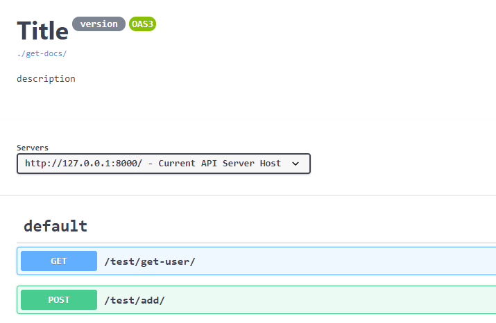
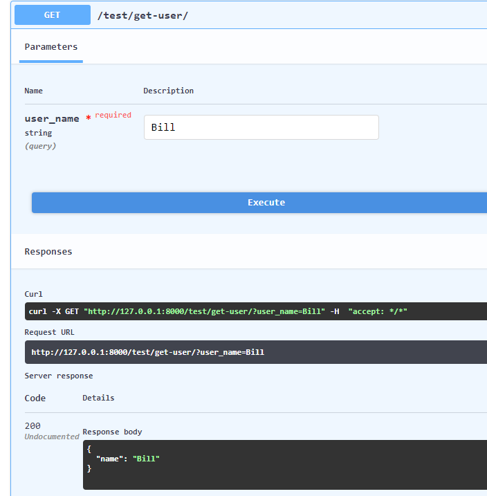
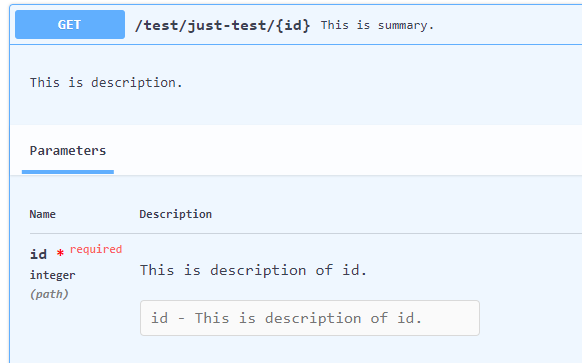

# Django Simple API

A non-intrusive component that can help you quickly create APIs.

## Install

Download and install from github

```
pip install git+https://github.com/abersheeran/django-simple-api.git@setup.py
```

Add django-simple-api to your `INSTALLED_APPS` in settings:

```python
INSTALLED_APPS = [
    ...
    "django_simple_api",
]
```

Add `SimpleApiMiddleware` to your `MIDDLEWARE` in settings:

```python
MIDDLEWARE = [
    ...
    "django_simple_api.middleware.SimpleApiMiddleware",
]
```

## Usage
### Parameter declaration and verification
Simple API use `pydantic` to declare parameters and parameter verification.

You can declare request parameters like the following example:

```python
# views.py
from django.views import View
from django.http.response import HttpResponse

from django_simple_api import Query

class JustTest(View):
    def get(self, request, id: int = Query(...)):  
        return HttpResponse(id)
```

Simple API has a total of 6 fields, corresponding to the parameters in different positions:

##### All fields and description
| Field     | Description |
| ---       | ---         |
| Query     | Indicates that this parameter is in the url query string. example: http://host/?param=1|
| Path      | Indicates that this parameter is a url path parameter. example: http://host/{param}/|
| Body      | Indicates that this parameter is in the request body, and the value can only be obtained in a non-GET request.|
| Cookie    | Indicates that this parameter is in Cookie.|
| Header    | Indicates that this parameter is in Header.|
| Exclusive | This is a special field, its parameter type should be `pydantic.Model`, it will get all the parameters required by `Model` from the location specified by `name`.|

For example:

```python
from pydantic import BaseModel, Field

class ArticleForm(BaseModel):
    article_title: str = Field(...)
    article_content: str = Field(...)


class JustTest(View):
    # The parameter names used in the above examples are for demonstration only.
    def post(self, request,
        param1: int = Query(...),
        param2: int = Query(...),
        param3: int = Path(...),
        # param4: str = Body(...),
        userid: int = Cookie(..., alias="uid"),
        csrf_token: str = Header(..., alias="X-CSRF-TOKEN"),

        # Simple API will get the `article_title` `article_content` parameter from the request body and create an object `article`
        article: ArticleForm = Exclusive("body"),
        ):

        # You can get the parameters like this
        title = article.article_title
        content = article.article_content

        # Or directly convert to a dictionary
        d = article.dict()  # {"article_title": ..., "article_content": ...}
        return HttpResponse(d)
```

⚠️ In the above example, you have two things to note:
* When you need to get parameters from `Header`, you may need to use `alias` to indicate the request header you want to get, because the name of the request header may not be a valid python identifier.
* When you use `Exclusive("body")` to get the form from a specified location, you can no longer use the `Body` field.

As you can see in the above example, Simple API also has the function of type conversion. If the parameter you pass in is legal for the declared type, it will be converted to the declared type without manual operation:

```python
class JustTest(View):
    def get(self, request, last_time: datetime.date = Query(...)):
        print(last_time, type(last_time)) 
        # 2008-08-08 <class 'datetime.date'> 
        return HttpResponse(last_time)
```

Use `Query(...)`  to declare the parameter, which means this parameter is required. If there is no `id` parameter in the query string for url, an error will be returned:

```shell script
[
    {
        "loc": [
            "id"
        ],
        "msg": "field required",
        "type": "value_error.missing"
    }
]
```

In addition, you can use default parameters like this:

```python
class JustTest(View):
    def get(self, request, id: int = Query(10)):  
        return HttpResponse(id)
    # Or
    def get(self, request, id: int = Query(None)):  
        return HttpResponse(id)
```

Or you can use the `default_factory` parameter and pass in a function to dynamically calculate the default value:

```python
def func():
    return 1000

class JustTest(View):
    def get(self, request, id: int = Query(default_factory=func)): 
        print(id)  # 1000
        return HttpResponse(id)
```

But you cannot use `default` and `default_factory` at the same time, otherwise an error will be reported:

```shell script
ValueError: cannot specify both default and default_factory
```

In addition to the `default`、`default_factory`, you can also use more attributes to constrain parameters, such as:

```python
class JustTest(View):
    # Use `const` to constrain the parameter value must be the same as the default value
    def get(self, request, param: int = Query(10, const=True)):
        print(param, type(param))
        return HttpResponse(param)
    
    # If your parameter is of numeric type , you can use `ge`、`gt`、`le`、`lt`、`multipleOf` and other attributes
    def get(self, request, 
            param1: int = Query(..., gt=10),  # must be > 10
            param2: int = Query(..., ge=10),  # must be >= 10
            param3: int = Query(..., lt=10),  # must be < 10
            param4: int = Query(..., le=10),  # must be <= 10
            param5: int = Query(..., multipleOf=10),  # must be a multiple of 10
        ):
        return HttpResponse(param)
```

And there are more attributes applied to `str` or `list` type, you can refer to the following table:

#### Field parameter description
| Name           | description |
| ---            | ---         |
| default        | since this is replacing the field’s default, its first argument is used to set the default, use ellipsis (``...``) to indicate the field is required|
| default_factory| callable that will be called when a default value is needed for this field. If both `default` and `default_factory` are set, an error is raised.|
| alias          | the public name of the field|
| title          | can be any string, used in the schema|
| description    | can be any string, used in the schema|
| const          | this field is required and *must* take it's default value|
| gt             | only applies to numbers, requires the field to be "greater than". The schema will have an ``exclusiveMinimum`` validation keyword|
| ge             | only applies to numbers, requires the field to be "greater than or equal to". The schema will have a ``minimum`` validation keyword|
| lt             | only applies to numbers, requires the field to be "less than". The schema will have an ``exclusiveMaximum`` validation keyword|
| le             | only applies to numbers, requires the field to be "less than or equal to". The schema will have a ``maximum`` validation keyword|
| multiple_of    | only applies to numbers, requires the field to be "a multiple of". The schema will have a ``multipleOf`` validation keyword|
| min_items      | only applies to list or tuple and set, requires the field to have a minimum length.|
| max_items      | only applies to list or tuple and set, requires the field to have a maximum length.|
| min_length     | only applies to strings, requires the field to have a minimum length. The schema will have a ``maximum`` validation keyword|
| max_length     | only applies to strings, requires the field to have a maximum length. The schema will have a ``maxLength`` validation keyword|
| regex          | only applies to strings, requires the field match again a regular expression pattern string. The schema will have a ``pattern`` validation keyword|
| extra          | any additional keyword arguments will be added as is to the schema|

When you finish the above tutorial, you can already declare parameters well. Then, if you have registered the `SimpleApiMiddleware` middleware, then all parameters will be automatically verified, and the detailed information of these parameters will be displayed in the interface document. The following will teach you how to generate the interface document.


### Generate documentation
Suppose you want to use the `GET` method and accept an argument, you can do this
```python
from django_simple_api import Query, allow_request_method

@allow_request_method("get")
def get_user(request, user_name: str = Query(...)):
    return JsonResponse({"name": user_name})
```
Register the view function in urlpatterns
```python
urlpatterns = [
    ...,
    path("get-user/", get_user),
]
```

`@allow_request_method("get")`Declare the request method allowed by the view function.

`user_name: str = Query(...)` Gets a required `String` parameter `user_name` from a `GET` request parameter.
If the parameter does not exist,the request will be rejected,it will return status code 422 and state the reason.

Of course you can pass in default parameters,`Query("Bill")`
Let's look at another example:
```python
from django_simple_api import Body

@csrf_exempt
@allow_request_method("post")
def add(request, first_num: int = Body(1), second_num: int = Body(2)):
    return JsonResponse({"result": first_num + second_num})
```
Execute the command
```shell script
curl -X POST "http://127.0.0.1:8000/add/" -H  "Content-Type: application/json" -d "{\"first_num\":3}"
```
You'll see response {"result": 5}

It represents getting two non-required parameters of type `integer` from the parameters of the `POST` request,
If the parameter type is `String`,The request will be rejected.

Because you declared `first_num` to be of type hint `int`,
When the parameters are injected, the conversion is done automatically for you,
So `first_num` and `second_num` can be added directly without the need for manual type conversion


Now you open the URL [http://127.0.0.1:8000/docs/](http://127.0.0.1:8000/docs/)



> You can see the API documentation online,and you can send mock requests on it




If you want to use multiple request methods in a view, please use class based view,
You can also add description information to the function, which will be displayed in the API documentation

```python
class JustTest(View):
    def get(
        self,
        request: HttpRequest,
        id: int = Path(..., description="This is description of id."),
    ) -> HttpResponse:
        """
        This is summary.

        This is description.
        """
        return HttpResponse(id)
```
Register the View in urlpatterns
```python
urlpatterns = [
    ...,
    path("just-test/<id>", JustTest.as_view()),
]
```
The path parameters `id` will be passed into the view by field Path,and you'll see a lot of descriptions in the API documentation



#### All fields that can be injected into a function
| Field name| Explain|
| ---       | ---    |
| Query     | |
| Body      | |
| Path      | |
| Cookie    | |
| Header    | |
| Exclusive | |

#### Field argument explain
| Name           | Explain |
| ---            | ---     |
| default        | since this is replacing the field’s default, its first argument is used to set the default, use ellipsis (``...``) to indicate the field is required|
| default_factory| callable that will be called when a default value is needed for this field. If both `default` and `default_factory` are set, an error is raised.|
| alias          | the public name of the field|
| title          | can be any string, used in the schema|
| description    | can be any string, used in the schema|
| const          | this field is required and *must* take it's default value|
| gt             | only applies to numbers, requires the field to be "greater than". The schema will have an ``exclusiveMinimum`` validation keyword|
| ge             | only applies to numbers, requires the field to be "greater than or equal to". The schema will have a ``minimum`` validation keyword|
| lt             | only applies to numbers, requires the field to be "less than". The schema will have an ``exclusiveMaximum`` validation keyword|
| le             | only applies to numbers, requires the field to be "less than or equal to". The schema will have a ``maximum`` validation keyword|
| multiple_of    | only applies to numbers, requires the field to be "a multiple of". The schema will have a ``multipleOf`` validation keyword|
| min_items      | only applies to list or tuple and set, requires the field to have a minimum length.|
| max_items      | only applies to list or tuple and set, requires the field to have a maximum length.|
| min_length     | only applies to strings, requires the field to have a minimum length. The schema will have a ``maximum`` validation keyword|
| max_length     | only applies to strings, requires the field to have a maximum length. The schema will have a ``maxLength`` validation keyword|
| regex          | only applies to strings, requires the field match again a regular expression pattern string. The schema will have a ``pattern`` validation keyword|
| extra          | any additional keyword arguments will be added as is to the schema|
